# Physical data model

The relational implementation of the **frozen conceptual domain model v1.2**
(Notion, 2026-08-10). The conceptual model is an authoritative input, not a
draft to redesign: where this document and the frozen model disagree, the frozen
model wins and the difference is a defect here.

- **What each conceptual entity became:** [Conceptual-to-relational map](#conceptual-to-relational-map)
- **Where each rule is enforced:** [Invariant enforcement matrix](#invariant-enforcement-matrix)
- **What is in release one and what is only structurally present:** [Scope](#release-one-versus-structurally-present)
- **How a schema change reaches production:** [`../migration-runbook.md`](../migration-runbook.md)

**Migration terminology**, stated once because the numbers are easy to confuse:

| Term                                                   | Count                                                                                       |
| ------------------------------------------------------ | ------------------------------------------------------------------------------------------- |
| Domain migration files                                 | 14                                                                                          |
| — the baseline set                                     | 13 files, organised as 12 logical parts (part 12 splits into `12a` staging and `12b` views) |
| — the correction pass                                  | 1 file, part 13                                                                             |
| Scaffold `init` migration, predating the domain schema | 1                                                                                           |
| Identity-join migration, added after the baseline      | 1 — `operator_accounts` (LAN-71)                                                            |
| **Files applied by a rebuild from empty**              | **16**                                                                                      |

The schema is **36 tables, 9 views and 31 enum types** in `public`, plus **3
tables** in the unexposed `staging` schema. Constraint, foreign-key and index
totals are deliberately not published here: they change with every migration,
nothing depends on the number, and a stale count is worse than none. Query the
catalogue if you need them.

## Conventions

These are decided once and applied everywhere. The reasoning is in
[ADR 0008](../adr/0008-relational-mapping-conventions.md).

| Convention                             | Choice                                                                      |
| -------------------------------------- | --------------------------------------------------------------------------- |
| Table names                            | `snake_case`, plural                                                        |
| Primary keys                           | `uuid`, `gen_random_uuid()`, never a natural key (invariant I1)             |
| Timestamps                             | `timestamptz`, UTC; calendar dates are `date`                               |
| Effective dating                       | `effective_from` / `effective_to`, `[)` half-open; `null` end means current |
| Frozen vocabularies                    | native PostgreSQL enums                                                     |
| Configurable or versioned vocabularies | tables                                                                      |
| History                                | append-only tables, enforced by privilege                                   |
| Current state                          | a column where it is authoritative; a view where it is derived              |
| `updated_at`                           | maintained by the service layer, not a trigger                              |

Two devices recur and are worth understanding before reading the schema.

**The cascading composite foreign key.** Several invariants are of the form
"this row may only exist while its parent is in a particular state". Enforcing
those with a trigger would put workflow in the database, which the architecture
record forbids. Instead the child carries a copy of the parent's discriminator
and a composite foreign key with `on update cascade`:

```sql
-- events has: unique (id, status)
attendance_records.event_status  →  events (id, status)  on update cascade
check (event_status = 'occurred')
```

The copy cannot drift, because the cascade rewrites it. Moving the event out of
`occurred` cascades into the child and breaks the child's own check, so the
update is refused while attendance exists. The result is invariant P5 enforced
declaratively, with no trigger and no trust placed in application code.

**Append-only by privilege.** The application reaches PostgreSQL as
`service_role`. History tables grant it `select, insert` and nothing else, so
history cannot be rewritten even by a bug in the service layer. Supabase's
default privileges also leave `truncate` granted, which would defeat this, so
every migration revokes from all three client roles before granting back exactly
what is needed.

## Implemented model

```mermaid
erDiagram
    PEOPLE ||--o{ PERSON_ALIASES : "known as"
    PEOPLE ||--o{ CONTACT_POINTS : "reachable at"
    PEOPLE ||--o{ SEASON_MEMBERSHIPS : holds
    PEOPLE ||--o{ RECRUITMENT_PROSPECTS : "may be"
    PEOPLE ||--o{ ROLE_ASSIGNMENTS : holds
    PEOPLE ||--o| PEOPLE : "merged into"
    PEOPLE ||--o| OPERATOR_ACCOUNTS : "signs in as"

    SEASONS ||--o{ SEASON_MEMBERSHIPS : scopes
    SEASONS ||--o{ EVENT_SERIES : schedules
    SEASONS ||--o{ EVENTS : scopes
    SEASONS ||--o{ ALTERNATIVE_GROUPS : scopes
    SEASONS ||--o{ ONBOARDING_ITEM_TYPES : configures
    SEASONS ||--o{ ROLE_ASSIGNMENTS : "scopes (coaching)"
    SEASONS }o--|| POSITION_VOCABULARIES : "draws positions from"
    COMMITTEE_YEARS ||--o{ ROLE_ASSIGNMENTS : "scopes (committee)"
    TERMS ||--o{ EVENTS : locates
    POSITION_VOCABULARIES ||--o{ POSITIONS : contains
    ROLES ||--o{ ROLE_ASSIGNMENTS : "seat for"
    ROLES ||--o{ ROLE_ALIASES : "also called"

    SEASON_MEMBERSHIPS ||--o{ SEASON_MEMBERSHIP_STATUS_EVENTS : "history of"
    SEASON_MEMBERSHIPS ||--o{ POSITION_ASSIGNMENTS : carries
    SEASON_MEMBERSHIPS ||--o{ JERSEY_ASSIGNMENTS : carries
    SEASON_MEMBERSHIPS ||--o{ ONBOARDING_ITEMS : completes
    SEASON_MEMBERSHIPS ||--o{ ELIGIBILITY_RECORDS : carries
    SEASON_MEMBERSHIPS ||--o{ AVAILABILITY_STATUSES : "history of"
    SEASON_MEMBERSHIPS ||--o| SEASON_MEMBERSHIPS : "carried forward from"
    POSITIONS ||--o{ POSITION_ASSIGNMENTS : "assigned as"
    ONBOARDING_ITEM_TYPES ||--o{ ONBOARDING_ITEMS : "instantiated as"

    EVENT_SERIES ||--o{ EVENTS : generates
    ALTERNATIVE_GROUPS ||--o{ EVENTS : "candidates for"
    EVENTS ||--o{ SCHEDULE_CHANGES : "history of"
    EVENTS ||--o{ EVENT_QUESTIONS : asks
    EVENTS ||--o{ EVENT_AUDIENCE_MEMBERS : "audience confirmed as"
    EVENTS ||--o{ INVITATIONS : issues
    EVENTS ||--o{ ATTENDANCE_RECORDS : records
    EVENT_AUDIENCE_MEMBERS ||--o| INVITATIONS : "resolved into"

    SEASON_MEMBERSHIPS ||--o{ EVENT_AUDIENCE_MEMBERS : "anchors (player)"
    PEOPLE ||--o{ EVENT_AUDIENCE_MEMBERS : "anchors (coach, committee, guest)"
    SEASON_MEMBERSHIPS ||--o{ INVITATIONS : "anchors (player)"
    PEOPLE ||--o{ INVITATIONS : "anchors (coach, committee, guest)"
    SEASON_MEMBERSHIPS ||--o{ ATTENDANCE_RECORDS : "anchors (player)"
    PEOPLE ||--o{ ATTENDANCE_RECORDS : "anchors (non-player)"

    INVITATIONS ||--o{ RSVP_RESPONSES : "answered by"
    INVITATIONS ||--o{ QUESTION_RESPONSES : answers
    EVENT_QUESTIONS ||--o{ QUESTION_RESPONSES : "answered by"
    INVITATIONS ||--o{ NOTIFICATION_JOBS : triggers
    NOTIFICATION_JOBS ||--o{ DELIVERY_RESULTS : attempts

    SEASONS ||--o{ WEEKLY_REPORTS : reports
    WEEKLY_REPORTS ||--o| WEEKLY_REPORTS : supersedes
    WEEKLY_REPORTS ||--o{ FOLLOW_UP_ACTIONS : produces
    PEOPLE ||--o{ AUDIT_EVENTS : "acts in"
```



The one new edge in the participation loop points one way only. The audience
says who was meant to be asked; the invitation says who was asked; the RSVP says
what they answered; attendance says who turned up. Each may disagree with the
next, and attendance still has no foreign key to any of them (invariant P6).

`audit_events` is deliberately not foreign-keyed to the entities it describes:
an audit row must outlive and out-scope its subject, including rows removed by
the redaction path (review F13).

## Conceptual-to-relational map

Every entity in frozen model §1.2. "Scope" is release-one execution scope versus
structurally present — see [Scope](#release-one-versus-structurally-present).

| Conceptual entity     | Table(s)                                     | Primary key      | Key relationships                                                            | Uniqueness                                               | State                                              | History                                         | Scope       |
| --------------------- | -------------------------------------------- | ---------------- | ---------------------------------------------------------------------------- | -------------------------------------------------------- | -------------------------------------------------- | ----------------------------------------------- | ----------- |
| Person                | `people`                                     | surrogate `uuid` | self-FK `merged_into_person_id`                                              | none — no natural key (I1)                               | none; alumni standing derived by `person_standing` | merge audited in place                          | Release one |
| — name variants       | `person_aliases`                             | surrogate        | → `people`                                                                   | `(person_id, alias)`                                     | —                                                  | append by nature                                | Release one |
| Contact Point         | `contact_points`                             | surrogate        | → `people`                                                                   | one preferred per `(person, kind)`, partial index        | `valid_from`/`valid_until`                         | superseded rows retained                        | Release one |
| Season                | `seasons`                                    | surrogate        | → `position_vocabularies`                                                    | `label`                                                  | `season_status` enum                               | open/close actor and time on the row            | Release one |
| Term                  | `terms`                                      | surrogate        | none — cycles stay independent                                               | `(name, academic_year)`                                  | —                                                  | —                                               | Release one |
| Committee Year        | `committee_years`                            | surrogate        | none                                                                         | `label`; ranges may not overlap (exclusion)              | —                                                  | actual AGM date stored                          | Release one |
| Season Membership     | `season_memberships`                         | surrogate        | → `people`, `seasons`, self-FK carry-forward                                 | `(person_id, season_id)` (I2)                            | `membership_status` enum on the row                | `season_membership_status_events`, append-only  | Release one |
| — lifecycle history   | `season_membership_status_events`            | surrogate        | → `season_memberships`                                                       | —                                                        | from/to status                                     | append-only by privilege                        | Release one |
| Recruitment Prospect  | `recruitment_prospects`                      | surrogate        | → `people`, `seasons`, conversion → membership                               | `(person_id, season_id)`                                 | `prospect_status` enum                             | —                                               | Structural  |
| Role                  | `roles`                                      | surrogate        | → `role_aliases`                                                             | `code`                                                   | —                                                  | —                                               | Release one |
| Role Assignment       | `role_assignments`                           | surrogate        | → `people`, `roles`, XOR `committee_years`/`seasons`                         | Office exclusions (I3)                                   | effective-dated                                    | new record per change (D11)                     | Release one |
| Position Assignment   | `position_assignments`                       | surrogate        | → membership, `positions`, vocabulary                                        | one per slot, exclusion (S1)                             | effective-dated                                    | superseding records (S4)                        | Release one |
| Jersey Assignment     | `jersey_assignments`                         | surrogate        | → membership                                                                 | `(season, kit, number)` among concurrent, exclusion (S2) | effective-dated                                    | superseding records                             | Release one |
| Onboarding Item       | `onboarding_items` + `onboarding_item_types` | surrogate        | → membership, type                                                           | `(membership, type)`; types `(season, code)`             | `onboarding_item_status` enum                      | —                                               | Release one |
| Eligibility Record    | `eligibility_records`                        | surrogate        | → membership                                                                 | one per `(membership, competition)` period, exclusion    | `eligibility_status` enum                          | effective-dated                                 | Structural  |
| Availability Status   | `availability_statuses`                      | surrogate        | → membership                                                                 | —                                                        | `availability_level` enum                          | append-only; current via `current_availability` | Release one |
| Event Series          | `event_series`                               | surrogate        | → `seasons`                                                                  | `(season_id, name)`                                      | `is_active`                                        | —                                               | Release one |
| Event                 | `events`                                     | surrogate        | → season, series, term, alternative group                                    | one approval per alternative group (E3)                  | `event_status` enum                                | `schedule_changes`                              | Release one |
| — audience definition | `event_audience_members`                     | surrogate        | → event, and membership **or** person                                        | one row per participant per event                        | —                                                  | retained through cancellation                   | Release one |
| — alternative group   | `alternative_groups`                         | surrogate        | → `seasons`                                                                  | `(season_id, label)`                                     | —                                                  | —                                               | Release one |
| Schedule Change       | `schedule_changes`                           | surrogate        | → `events`                                                                   | —                                                        | —                                                  | append-only by privilege (E2)                   | Release one |
| Event Question        | `event_questions`                            | surrogate        | → `events`                                                                   | `(event_id, prompt)`                                     | —                                                  | —                                               | Release one |
| Invitation            | `invitations`                                | surrogate        | → **audience member**, event (with status), season, membership **or** person | one per invitee per event                                | `invitation_status` enum                           | —                                               | Release one |
| RSVP Response         | `rsvp_responses`                             | surrogate        | → `invitations`                                                              | `(invitation_id, responded_at)`                          | binary `rsvp_value`                                | append-only; current via `current_rsvp`         | Release one |
| Question Response     | `question_responses`                         | surrogate        | → invitation, question (same event)                                          | `(invitation, question)`                                 | —                                                  | current row                                     | Release one |
| Attendance Record     | `attendance_records`                         | surrogate        | → event (must be `occurred`), membership **or** person                       | one per participant per event                            | `attendance_presence` enum                         | —                                               | Release one |
| Notification Job      | `notification_jobs`                          | surrogate        | → invitation / event / person                                                | `idempotency_key` (M1)                                   | six-state enum (M4)                                | attempts in `delivery_results`                  | Release one |
| Delivery Result       | `delivery_results`                           | surrogate        | → `notification_jobs`                                                        | `(job, attempt_number)`                                  | `delivery_outcome` enum                            | append-only by privilege                        | Release one |
| Weekly Report         | `weekly_reports`                             | surrogate        | → `seasons`, self-FK supersession                                            | `(season, report_on, version)`                           | none — supersession derived                        | insert-only snapshot (M5)                       | Release one |
| Follow-Up Action      | `follow_up_actions`                          | surrogate        | → season, report, subjects                                                   | —                                                        | `follow_up_status` enum                            | mutable, by design                              | Release one |
| Audit Event           | `audit_events`                               | surrogate        | polymorphic, deliberately not FK'd                                           | —                                                        | free `from_state`/`to_state`                       | append-only by privilege (M2)                   | Release one |

### Supporting structures that were not conceptual entities

These are physical necessities, not new product scope.

| Table                                | Why it exists                                                                                                                                                                                                        |
| ------------------------------------ | -------------------------------------------------------------------------------------------------------------------------------------------------------------------------------------------------------------------- |
| `position_vocabularies`, `positions` | Frozen model §1.2 calls the position list "a versioned reference list". Making it data is what lets invariant S3 be a foreign key.                                                                                   |
| `onboarding_item_types`              | The model says item types are season-configurable. A per-season type table is how "configurable" is expressed without schema changes.                                                                                |
| `alternative_groups`                 | Register D6's alternative group needs an identity for invariant E3's unique index to key on.                                                                                                                         |
| `role_aliases`, `person_aliases`     | The model names alias support on Role and Person; a repeating attribute is a table.                                                                                                                                  |
| `season_membership_status_events`    | Register D1 makes per-stint reporting a query over status history, which needs a typed home.                                                                                                                         |
| `staging.*`                          | Architecture cheat sheet §1: legacy files land in staging, are validated, and only then promote.                                                                                                                     |
| `event_audience_members`             | The frozen model gives Event an _audience definition_, and invariant P7 needs `never-invited` to be reportable. A repeating attribute is a table; without it the database cannot name anyone the approver confirmed. |
| `operator_accounts`                  | An **identity join**, not a new club concept: one auth user to one Person, so a session can name the actor an audited write records (M2). No role column. See [below](#operator-accounts).                           |

#### Operator accounts

`public.operator_accounts` (LAN-71) is how an authenticated session becomes a
`people.id` — the actor id that `audit_events.actor_person_id` and every
`*_by_person_id` column needs. Four decisions are worth stating, because each
one is load-bearing rather than incidental:

- **Not a column on `people`.** An auth account is an operational fact about how
  somebody signs in, not a durable club fact about who they are. A Person who
  never logs in is normal.
- **No role column.** Authorization reads `role_assignments`, so a committee
  handover changes who can do what without touching authentication.
- **Deactivation, never deletion.** `is_active = false` requires a dated
  `disabled_at` (`operator_accounts_disabled_is_dated`), and `service_role`
  holds `select, insert, update` but deliberately **no `delete`**.
- **`on delete restrict` on both foreign keys.** Neither the Person nor the
  `auth.users` row may be deleted out from under history, so an actor named by
  an audited write stays resolvable (invariant M2).

RLS is enabled with zero policies and no grant to `anon` or `authenticated`, per
[ADR 0010](../adr/0010-domain-table-access-posture.md). Resolution lives in
`src/lib/auth/operator.ts`; it reads the verified user from
`supabase.auth.getUser()` and treats an assignment as current when
`effective_to is null or effective_to > now()`. Nothing enforces those role
codes yet — that is LAN-73.

### Derived views

No view is materialised, so there is no cache and nothing to drift.

| View                         | Answers                                                                                                                           |
| ---------------------------- | --------------------------------------------------------------------------------------------------------------------------------- |
| `current_availability`       | The standing Green/Orange/Red per membership                                                                                      |
| `current_rsvp`               | The standing answer per invitation                                                                                                |
| `invitation_response_state`  | Invariant P7's partition, computed from the resolved audience outward; excludes non-soliciting events (E6)                        |
| `nonresponse_queue`          | Requirement 6's escalation queue — invitees who were asked and have not answered                                                  |
| `uninvited_audience_members` | People the approver confirmed who were never actually invited: an approval defect, deliberately kept out of the nonresponse queue |
| `rsvp_attendance_mismatches` | Requirement 7's flagged mismatches                                                                                                |
| `constitutional_membership`  | Invariant I5 — admitted **and** paid, reported beside operational readiness                                                       |
| `person_standing`            | Alumni derivation, operator-overridable                                                                                           |
| `transition_ledger`          | Invariant M2 as one stream over the typed history tables plus `audit_events`                                                      |

## Invariant enforcement matrix

Every invariant in frozen model §4, and the layer that carries it. Test IDs
refer to `tests/schema-invariants.test.ts` and `tests/schema-accepts.test.ts`.

| #   | Invariant                                                                                  | Enforced by                                                                                                                                                 | Tested                                                                                                         |
| --- | ------------------------------------------------------------------------------------------ | ----------------------------------------------------------------------------------------------------------------------------------------------------------- | -------------------------------------------------------------------------------------------------------------- |
| I1  | One internal identifier; no natural key                                                    | Schema shape — every PK is a surrogate `uuid` and no unique constraint exists on a name                                                                     | Structural                                                                                                     |
| I2  | At most one membership per person per season                                               | `unique (person_id, season_id)`                                                                                                                             | Yes                                                                                                            |
| I3  | One Office per person; one holder per Office                                               | Two GiST exclusion constraints over `daterange`                                                                                                             | Yes (both halves)                                                                                              |
| I4  | Readiness never implies eligibility                                                        | Separate `eligibility_records` table; no boolean on membership                                                                                              | Yes                                                                                                            |
| I5  | Constitutional membership derived and reported distinctly                                  | `constitutional_membership` view; a waiver is reported as its own fact                                                                                      | Yes                                                                                                            |
| I6  | Merges audited, both identities preserved                                                  | `people_merge_is_fully_audited` check; the losing row is never deleted                                                                                      | Yes                                                                                                            |
| P1  | Invitation requires an approved event                                                      | Composite FK to `events (id, status)` + check                                                                                                               | Yes                                                                                                            |
| P2  | RSVP requires an invitation; value is binary                                               | FK + `rsvp_value` enum                                                                                                                                      | Yes                                                                                                            |
| P3  | A non-acceptance must carry a reason                                                       | `rsvp_responses_no_requires_a_reason` check                                                                                                                 | Yes                                                                                                            |
| P4  | Invitation exists unanswered; cancellation deletes nothing                                 | No cascade delete; append-only responses; grants withhold `delete`                                                                                          | Yes                                                                                                            |
| P5  | Attendance requires an `occurred` event                                                    | Composite FK + `event_status = 'occurred'` check                                                                                                            | Yes, incl. the reverse transition                                                                              |
| P6  | Attendance may exist without invitation or RSVP                                            | Schema shape — no FK from attendance to either                                                                                                              | Yes                                                                                                            |
| P7  | Five-way response state, reportable                                                        | `event_audience_members` supplies the population; `invitation_response_state` left-joins invitations to it, so `never-invited` is derivable                 | Yes — all five states, plus the negative case that a non-audience member is not reported                       |
| P8  | Player anchors to membership; others to person                                             | `*_anchor_matches_capacity` checks on audience, invitations and attendance                                                                                  | Yes                                                                                                            |
| S1  | One offence + one defence + special teams; one per slot                                    | GiST exclusion on `(membership, slot, period)` + slot/side check                                                                                            | Yes                                                                                                            |
| S2  | Jersey unique within `(season, kit)` among concurrent                                      | GiST exclusion, excluding flagged import conflicts                                                                                                          | Yes, both directions                                                                                           |
| S3  | Positions come from the season's vocabulary version                                        | Two composite FKs                                                                                                                                           | Yes                                                                                                            |
| S4  | Assignments effective-dated; corrected by superseding                                      | Effective-dated columns + exclusion constraints                                                                                                             | Partly — supersession discipline is **service layer**                                                          |
| E1a | Approval requires a date, a type, a recorded approver and a recorded audience confirmation | `events_approval_requires_date_and_audience` check                                                                                                          | Yes                                                                                                            |
| E1b | The confirmed audience is **non-empty**                                                    | **Service layer** — `approveEvent` in `src/lib/services/event-approval.ts`, which refuses inside the transaction once the stored audience is read           | Yes, both sides: one test asserts the database accepts an empty audience, another that the service refuses one |
| E2  | Every schedule change produces a record                                                    | **Service layer** — the database cannot know a change was material                                                                                          | Append-only storage tested                                                                                     |
| E3  | At most one approval per alternative group                                                 | Partial unique index on `approved_at is not null`                                                                                                           | Yes                                                                                                            |
| E4  | Two or more events on one date is legal                                                    | Schema shape — deliberately no uniqueness on `(season, date)`                                                                                               | Yes                                                                                                            |
| E5  | Occurrence is asserted, never inferred                                                     | `events_outcome_is_asserted` check                                                                                                                          | Yes                                                                                                            |
| E6  | No solicitation → no obligation, deadline or expiry                                        | Two checks, one on each table                                                                                                                               | Yes, both                                                                                                      |
| A1  | Availability history append-only                                                           | Privilege: `select, insert` only                                                                                                                            | Yes, including a real `update` attempt                                                                         |
| A2  | No field can hold a diagnosis or treatment                                                 | Schema shape — the columns do not exist                                                                                                                     | Yes, schema-wide scan                                                                                          |
| A3  | A return to green records its confirmer                                                    | `availability_statuses_green_records_its_confirmer` check                                                                                                   | Yes                                                                                                            |
| M1  | Unique idempotency key; atomic claim                                                       | `unique (idempotency_key)`; **service layer** derives it as `event:<event>:invitation:<capacity>:<participant>` (LAN-77) and owns the atomic claim (LAN-78) | Key and derivation tested; the claim is not built yet                                                          |
| M2  | Every transition writes an immutable record                                                | Append-only history tables + `audit_events`; **service layer** writes them                                                                                  | Storage tested                                                                                                 |
| M3  | Archived records immutable outside the correction workflow                                 | **Service layer** — reversibility of a correction is a workflow decision                                                                                    | No                                                                                                             |
| M4  | Exactly six job states; delivery truth in results alone                                    | Enum with six values; no delivery column on `invitations`                                                                                                   | Yes                                                                                                            |
| M5  | Published report is an immutable snapshot                                                  | Insert-only table with no status column; supersession bound by composite FK to the same `season_id` and `report_on`                                         | Yes, including cross-season and cross-date rejection                                                           |

### Rules deliberately left to TypeScript

The architecture record is explicit that PostgreSQL owns durable relational
integrity and TypeScript owns changeable workflow behaviour. These are the rules
kept above the database on purpose, and why.

| Rule                                          | Why not the database                                                                                                                                                                                                                                                                                                                                                                                                                                                                                                                                                                                                                                                                                                                                                                                                                                                                                                                               |
| --------------------------------------------- | -------------------------------------------------------------------------------------------------------------------------------------------------------------------------------------------------------------------------------------------------------------------------------------------------------------------------------------------------------------------------------------------------------------------------------------------------------------------------------------------------------------------------------------------------------------------------------------------------------------------------------------------------------------------------------------------------------------------------------------------------------------------------------------------------------------------------------------------------------------------------------------------------------------------------------------------------- |
| **A non-empty confirmed audience** (E1b)      | The database holds the audience and refuses an approval that records no confirmation, but "at least one row exists in another table" is not expressible as a constraint without a trigger, which the architecture record forbids for workflow. Built in LAN-77, and **not** where an earlier version of this page said. The audience is written by `saveEventAudience` while the event is still a draft — which deliberately _accepts_ an empty proposal, because clearing a selection is a thing an operator must be able to do. The refusal is `members.length === 0` in `approveEvent` (`src/lib/services/event-approval.ts`), **inside** the transaction, after the stored audience has been read under the event's row lock. See [ADR 0022](../adr/0022-audience-proposed-then-frozen.md) for why the two are separate steps, and [ADR 0012](../adr/0012-explicit-event-audience.md) for the declarative alternative considered and rejected. |
| **Sequential report version allocation** (M5) | The database binds a superseding report to the same season and reporting date and permits only one successor per predecessor. That `version` is exactly `predecessor.version + 1`, and that the predecessor is the current latest, are read-then-write decisions — they need the transaction to have looked at existing rows, which is a service-layer read, not a constraint.                                                                                                                                                                                                                                                                                                                                                                                                                                                                                                                                                                     |
| **Legal state transitions** (frozen model §2) | A transition table is workflow. Encoding it in check constraints or triggers would make the schema the workflow engine and require a migration to change club policy. The database enforces what each state _requires_ (an approval needs an approver; an occurrence needs an asserter), not which state may follow which.                                                                                                                                                                                                                                                                                                                                                                                                                                                                                                                                                                                                                         |
| **Who may trigger a transition**              | Authorization is the service layer's primary job (Requirement 10). RLS is the backstop, not the rule.                                                                                                                                                                                                                                                                                                                                                                                                                                                                                                                                                                                                                                                                                                                                                                                                                                              |
| **Writing the audit record** (M2)             | A trigger would guarantee the row but not its meaning — the actor and reason live in the request, not in the table. The service layer writes state and audit in one transaction.                                                                                                                                                                                                                                                                                                                                                                                                                                                                                                                                                                                                                                                                                                                                                                   |
| **Atomic job claiming** (M1)                  | `select … for update skip locked` is a query pattern, not a constraint.                                                                                                                                                                                                                                                                                                                                                                                                                                                                                                                                                                                                                                                                                                                                                                                                                                                                            |
| **Material-change detection** (E2)            | Whether a change is material enough to notify invitees is club policy, and the threshold is explicitly operational.                                                                                                                                                                                                                                                                                                                                                                                                                                                                                                                                                                                                                                                                                                                                                                                                                                |
| **Archived-season immutability** (M3)         | Requirement 13's correction workflow must remain possible; a blanket database lock on archived rows would block the very workflow that makes corrections auditable.                                                                                                                                                                                                                                                                                                                                                                                                                                                                                                                                                                                                                                                                                                                                                                                |
| **Reminder scheduling**                       | Cloud Scheduler owns _when_; the database records what is due. No cron jobs in PostgreSQL.                                                                                                                                                                                                                                                                                                                                                                                                                                                                                                                                                                                                                                                                                                                                                                                                                                                         |
| **`updated_at` maintenance**                  | A trigger here would be harmless, but the rule "no triggers" is easier to keep than "no triggers except the ones we like".                                                                                                                                                                                                                                                                                                                                                                                                                                                                                                                                                                                                                                                                                                                                                                                                                         |

## Privacy-sensitive and contingent fields

| Concern                              | Treatment                                                                                                                                                                                                                                                                                                                                                                                                             |
| ------------------------------------ | --------------------------------------------------------------------------------------------------------------------------------------------------------------------------------------------------------------------------------------------------------------------------------------------------------------------------------------------------------------------------------------------------------------------- |
| **Availability**                     | `availability_statuses` holds a level, dates, and two person references — nothing else. Requirement 8 is met structurally: there is no column capable of holding a diagnosis, and `tests/schema-security.test.ts` scans the whole schema for one. Reachable only through the privileged server path.                                                                                                                  |
| **The contingent availability note** | Not created. Review F10 makes a bounded note contingent on the pending Oxford / Sports Federation answer, and the model says no free-text field exists until that answer approves one. When it does, it lands as one nullable column on `availability_statuses` — or, if its retention rule differs, a single side table keyed by that table's id. Nothing else references it, so removing it is dropping one object. |
| **Eligibility evidence**             | `evidence_reference` is an external pointer (a BUCS Play registration id). Never evidence content, never academic or medical detail.                                                                                                                                                                                                                                                                                  |
| **Contact details**                  | Raw intake is stored unvalidated by design; normalisation is separate and reversible. Superseded contacts are retained so alumni stay contactable.                                                                                                                                                                                                                                                                    |
| **Notification payloads**            | `template_variables` holds substitution values, not message bodies.                                                                                                                                                                                                                                                                                                                                                   |
| **Legacy staging**                   | `staging` is not exposed to the Data API and holds synthetic fixtures only. No real roster data enters it before the pre-pilot gate in the [migration runbook](../migration-runbook.md).                                                                                                                                                                                                                              |

## Release one versus structurally present

**Release one execution scope.** The core loop and everything the eight approved
workflows touch: identity and contact, seasonal membership and its lifecycle,
positions and jerseys, onboarding, availability, events and schedules,
invitations, RSVP, attendance, notification jobs and delivery results, the
weekly report, follow-up actions, and audit.

**Structurally present, not yet driven by a workflow.** `recruitment_prospects`
(the recruitment workflow's design is deliberately still open — register D3);
`eligibility_records` beyond `club_play`; `event_questions` beyond transport;
`alternative_groups`; the `staging` schema.

**Deliberately not implemented.** Frozen model §1.2 defers four conceptual
entities from the release-one schema (review F14): **Channel Presence**,
**Comms Group** and **Group Membership**, **recognition counts**, and **durable
kit ownership**. They remain in the conceptual model and are omitted here
because the model says they are deferred "unless a locked workflow pulls them
in", and none does. Each is additive when it arrives — all four hang off
`people` with no change to any existing relationship. Kit ownership is the
likeliest early pull, since the subscription invoice prices against it.

**Absent by decision, not oversight** (frozen model §1.2 "Deliberately absent"):
no kit-inventory ledger, no finance beyond subscription status, no
game-logistics entity, no statistics, no media, no flag-football dimension. The
event model is deliberately _not_ shaped to absorb game-day logistics later
without a conscious redesign.

## Correction history

**2026-08-10 — bounded correction pass** after independent verification of
PR #5. Two findings were accepted and fixed in migration part 13:

- **The explicit event audience was not represented.** The baseline stored
  `audience_confirmed_at` and `audience_confirmed_by_person_id` — confirmation
  _metadata_ — and no record of who was confirmed. The claim that every frozen
  relationship was represented was therefore wrong, and P7's `never-invited`
  was not derivable. `event_audience_members` is the missing relation, and the
  P7 view now computes outward from it.
- **Weekly-report supersession could cross report series.** `supersedes_id` was
  an unconstrained self reference; it is now bound by composite foreign key to
  the same `season_id` and `report_on`.

The same pass reclassified invariant E1 into the half the database proves (E1a)
and the half the service layer owns (E1b), rather than continuing to present the
event check as proof of a confirmed audience.

## Known deviations from the frozen model

One, and it is a deferral the model itself directs:

- The four review-F14 entities above are not implemented. The frozen model marks
  them schema-deferred; the ticket's traceability list names structural
  coverage. The model governs, and the difference is recorded here as required.

Nothing else in the frozen model is renamed, narrowed or absent.
