# Physical data model

The relational implementation of the **frozen conceptual domain model v1.2**
(Notion, 2026-08-10). The conceptual model is an authoritative input, not a
draft to redesign: where this document and the frozen model disagree, the frozen
model wins and the difference is a defect here.

- **What each conceptual entity became:** [Conceptual-to-relational map](#conceptual-to-relational-map)
- **Where each rule is enforced:** [Invariant enforcement matrix](#invariant-enforcement-matrix)
- **What is in release one and what is only structurally present:** [Scope](#release-one-versus-structurally-present)
- **How a schema change reaches production:** [`../migration-runbook.md`](../migration-runbook.md)

**Migration terminology**, stated once because the numbers are easy to confuse:

| Term                                                   | Count                                                                                       |
| ------------------------------------------------------ | ------------------------------------------------------------------------------------------- |
| Domain migration files                                 | 14                                                                                          |
| — the baseline set                                     | 13 files, organised as 12 logical parts (part 12 splits into `12a` staging and `12b` views) |
| — the correction pass                                  | 1 file, part 13                                                                             |
| Scaffold `init` migration, predating the domain schema | 1                                                                                           |
| Identity-join migration, added after the baseline      | 1 — `operator_accounts` (LAN-71)                                                            |
| Delivery-machinery migration                           | 1 — RSVP tokens, attempts and callbacks (LAN-78)                                            |
| View-correction migration                              | 1 — the mismatch view sees walk-ups (LAN-81)                                                |
| Role-catalogue migrations                              | 2 — structure, then the twenty approved seats (LAN-128)                                     |
| Invitation-state migration                             | 1 — invitation state on `operator_accounts` (LAN-131)                                       |
| Email re-home migration                                | 1 — `email_rehome_pending_at` on `operator_accounts` (LAN-132)                              |
| **Files applied by a rebuild from empty**              | **22**                                                                                      |

The schema is **40 tables, 9 views and 31 enum types** in `public`, plus **3
tables** in the unexposed `staging` schema. (The published totals had been left
at the domain baseline's 36 tables and 16 files through two later migrations;
they are counted from the catalogue here, and the two missing rows above are
restored.) Constraint, foreign-key and index
totals are deliberately not published here: they change with every migration,
nothing depends on the number, and a stale count is worse than none. Query the
catalogue if you need them.

## Conventions

These are decided once and applied everywhere. The reasoning is in
[ADR 0008](../adr/0008-relational-mapping-conventions.md).

| Convention                             | Choice                                                                      |
| -------------------------------------- | --------------------------------------------------------------------------- |
| Table names                            | `snake_case`, plural                                                        |
| Primary keys                           | `uuid`, `gen_random_uuid()`, never a natural key (invariant I1)             |
| Timestamps                             | `timestamptz`, UTC; calendar dates are `date`                               |
| Effective dating                       | `effective_from` / `effective_to`, `[)` half-open; `null` end means current |
| Frozen vocabularies                    | native PostgreSQL enums                                                     |
| Configurable or versioned vocabularies | tables                                                                      |
| History                                | append-only tables, enforced by privilege                                   |
| Current state                          | a column where it is authoritative; a view where it is derived              |
| `updated_at`                           | maintained by the service layer, not a trigger                              |

Two devices recur and are worth understanding before reading the schema.

**The cascading composite foreign key.** Several invariants are of the form
"this row may only exist while its parent is in a particular state". Enforcing
those with a trigger would put workflow in the database, which the architecture
record forbids. Instead the child carries a copy of the parent's discriminator
and a composite foreign key with `on update cascade`:

```sql
-- events has: unique (id, status)
attendance_records.event_status  →  events (id, status)  on update cascade
check (event_status in ('approved', 'cancelled'))
```

The copy cannot drift, because the cascade rewrites it. The check then decides
which parent states a child row may follow its parent into: cancelling the
event rewrites `cancelled` onto every attendance row, and the check admits it,
so the register survives the event being called off. A draft is refused, and
nothing cascades a draft onto an attendance row, so that refusal is unreachable
except by a caller writing the row directly.

**The width of that check is load-bearing, and it is a decision, not an
oversight.** `attendance_records` carried `= 'approved'` until LAN-156 and the
cascade therefore made a cancellation _fail_ whenever a register had been
opened — which W6 and D57 say must not happen, and which D71's six-hour buffer
made the ordinary case rather than an unlucky one.
`20260823090000_attendance_survives_cancellation.sql` widened it to the shape
`invitations` already carried for P1. The consequence to hold in mind is that
the database no longer refuses attendance _created_ against a cancelled event:
it cannot, because the cascade has to be able to write that value. That rule
lives in `closedReasonFor` in `src/lib/services/attendance.ts`, once, and every
write path asks it.

Its other half is the **clock**, which a check constraint cannot read. Two
different questions are asked of it, and they are not the same question:

- **Has the event happened?** Since LAN-151 that is derived rather than stored:
  D30 says the date passed and the event was not cancelled. It is **not** one
  shared function, and this document said it was until finding CBH-3 checked.
  Four places derive it independently, in three languages, and they agree:
  `derivedEventState` in `src/lib/services/event-input.ts` for every screen;
  the `case` in `listCurrentSeasonEvents` that backs the events list's
  **Occurred** filter; `public.rsvp_attendance_mismatches` in SQL, against
  Europe/London; and `scripts/seed-local.mjs`, choosing which sessions get a
  register. Each is covered by its own test. Consolidating them onto one
  function is a reasonable future change and is deliberately not one this
  package made — it would alter executable behaviour on four surfaces to fix a
  sentence in a document.
- **May the register be opened?** That is D71's buffer, in
  `src/lib/services/attendance-window.ts`: it opens
  `ATTENDANCE_REGISTER_BUFFER_HOURS` before the event starts and never closes
  (D72), and a register with anything already recorded against it stays open
  whatever the clock says. It deliberately opens **before** the event has
  happened, because the realistic moment somebody takes a register is standing
  at the pitch as people arrive. `readAttendanceBoard` and every write path ask
  it through the same function, so a screen cannot offer a sheet the save then
  refuses.

**Append-only by privilege.** The application reaches PostgreSQL as
`service_role`. History tables grant it `select, insert` and nothing else, so
history cannot be rewritten even by a bug in the service layer. Supabase's
default privileges also leave `truncate` granted, which would defeat this, so
every migration revokes from all three client roles before granting back exactly
what is needed.

## Implemented model

```mermaid
erDiagram
    PEOPLE ||--o{ PERSON_ALIASES : "known as"
    PEOPLE ||--o{ CONTACT_POINTS : "reachable at"
    PEOPLE ||--o{ SEASON_MEMBERSHIPS : holds
    PEOPLE ||--o{ RECRUITMENT_PROSPECTS : "may be"
    PEOPLE ||--o{ ROLE_ASSIGNMENTS : holds
    PEOPLE ||--o| PEOPLE : "merged into"
    PEOPLE ||--o| OPERATOR_ACCOUNTS : "signs in as"

    SEASONS ||--o{ SEASON_MEMBERSHIPS : scopes
    SEASONS ||--o{ EVENT_SERIES : schedules
    SEASONS ||--o{ EVENTS : scopes
    SEASONS ||--o{ ALTERNATIVE_GROUPS : scopes
    SEASONS ||--o{ ONBOARDING_ITEM_TYPES : configures
    SEASONS ||--o{ ROLE_ASSIGNMENTS : "scopes (coaching)"
    SEASONS }o--|| POSITION_VOCABULARIES : "draws positions from"
    COMMITTEE_YEARS ||--o{ ROLE_ASSIGNMENTS : "scopes (committee)"
    TERMS ||--o{ EVENTS : locates
    POSITION_VOCABULARIES ||--o{ POSITIONS : contains
    ROLES ||--o{ ROLE_ASSIGNMENTS : "seat for"
    ROLES ||--o{ ROLE_ALIASES : "also called"

    SEASON_MEMBERSHIPS ||--o{ SEASON_MEMBERSHIP_STATUS_EVENTS : "history of"
    SEASON_MEMBERSHIPS ||--o{ POSITION_ASSIGNMENTS : carries
    SEASON_MEMBERSHIPS ||--o{ JERSEY_ASSIGNMENTS : carries
    SEASON_MEMBERSHIPS ||--o{ ONBOARDING_ITEMS : completes
    SEASON_MEMBERSHIPS ||--o{ ELIGIBILITY_RECORDS : carries
    SEASON_MEMBERSHIPS ||--o{ AVAILABILITY_STATUSES : "history of"
    SEASON_MEMBERSHIPS ||--o| SEASON_MEMBERSHIPS : "carried forward from"
    POSITIONS ||--o{ POSITION_ASSIGNMENTS : "assigned as"
    ONBOARDING_ITEM_TYPES ||--o{ ONBOARDING_ITEMS : "instantiated as"

    EVENT_SERIES ||--o{ EVENTS : generates
    ALTERNATIVE_GROUPS ||--o{ EVENTS : "candidates for"
    EVENTS ||--o{ SCHEDULE_CHANGES : "history of"
    EVENTS ||--o{ EVENT_QUESTIONS : asks
    EVENTS ||--o{ EVENT_AUDIENCE_MEMBERS : "audience confirmed as"
    EVENTS ||--o{ INVITATIONS : issues
    EVENTS ||--o{ ATTENDANCE_RECORDS : records
    EVENT_AUDIENCE_MEMBERS ||--o| INVITATIONS : "resolved into"

    SEASON_MEMBERSHIPS ||--o{ EVENT_AUDIENCE_MEMBERS : "anchors (player)"
    PEOPLE ||--o{ EVENT_AUDIENCE_MEMBERS : "anchors (coach, committee, guest)"
    SEASON_MEMBERSHIPS ||--o{ INVITATIONS : "anchors (player)"
    PEOPLE ||--o{ INVITATIONS : "anchors (coach, committee, guest)"
    SEASON_MEMBERSHIPS ||--o{ ATTENDANCE_RECORDS : "anchors (player)"
    PEOPLE ||--o{ ATTENDANCE_RECORDS : "anchors (non-player)"

    INVITATIONS ||--o{ RSVP_RESPONSES : "answered by"
    INVITATIONS ||--o{ QUESTION_RESPONSES : answers
    EVENT_QUESTIONS ||--o{ QUESTION_RESPONSES : "answered by"
    INVITATIONS ||--o{ NOTIFICATION_JOBS : triggers
    INVITATIONS ||--o{ RSVP_ACCESS_TOKENS : "reachable through"
    RSVP_ACCESS_TOKENS ||--o| RSVP_ACCESS_TOKENS : "superseded by"
    NOTIFICATION_JOBS ||--o{ DELIVERY_ATTEMPTS : "attempted as"
    NOTIFICATION_JOBS ||--o{ DELIVERY_RESULTS : "concluded as"
    DELIVERY_ATTEMPTS ||--o| RSVP_ACCESS_TOKENS : carries
    DELIVERY_ATTEMPTS ||--o{ DELIVERY_CALLBACKS : "confirmed by"

    SEASONS ||--o{ WEEKLY_REPORTS : reports
    WEEKLY_REPORTS ||--o| WEEKLY_REPORTS : supersedes
    WEEKLY_REPORTS ||--o{ FOLLOW_UP_ACTIONS : produces
    PEOPLE ||--o{ AUDIT_EVENTS : "acts in"
```



The one new edge in the participation loop points one way only. The audience
says who was meant to be asked; the invitation says who was asked; the RSVP says
what they answered; attendance says who turned up. Each may disagree with the
next, and attendance still has no foreign key to any of them (invariant P6).

`audit_events` is deliberately not foreign-keyed to the entities it describes:
an audit row must outlive and out-scope its subject, including rows removed by
the redaction path (review F13).

## Conceptual-to-relational map

Every entity in frozen model §1.2. "Scope" is release-one execution scope versus
structurally present — see [Scope](#release-one-versus-structurally-present).

| Conceptual entity     | Table(s)                                     | Primary key      | Key relationships                                                            | Uniqueness                                               | State                                                | History                                         | Scope       |
| --------------------- | -------------------------------------------- | ---------------- | ---------------------------------------------------------------------------- | -------------------------------------------------------- | ---------------------------------------------------- | ----------------------------------------------- | ----------- |
| Person                | `people`                                     | surrogate `uuid` | self-FK `merged_into_person_id`                                              | none — no natural key (I1)                               | none; alumni standing derived by `person_standing`   | merge audited in place                          | Release one |
| — name variants       | `person_aliases`                             | surrogate        | → `people`                                                                   | `(person_id, alias)`                                     | —                                                    | append by nature                                | Release one |
| Contact Point         | `contact_points`                             | surrogate        | → `people`                                                                   | one preferred per `(person, kind)`, partial index        | `valid_from`/`valid_until`                           | superseded rows retained                        | Release one |
| Season                | `seasons`                                    | surrogate        | → `position_vocabularies`                                                    | `label`                                                  | `season_status` enum                                 | open/close actor and time on the row            | Release one |
| Term                  | `terms`                                      | surrogate        | none — cycles stay independent                                               | `(name, academic_year)`                                  | —                                                    | —                                               | Release one |
| Committee Year        | `committee_years`                            | surrogate        | none                                                                         | `label`; ranges may not overlap (exclusion)              | —                                                    | actual AGM date stored                          | Release one |
| Season Membership     | `season_memberships`                         | surrogate        | → `people`, `seasons`, self-FK carry-forward                                 | `(person_id, season_id)` (I2)                            | `membership_status` enum on the row                  | `season_membership_status_events`, append-only  | Release one |
| — lifecycle history   | `season_membership_status_events`            | surrogate        | → `season_memberships`                                                       | —                                                        | from/to status                                       | append-only by privilege                        | Release one |
| Recruitment Prospect  | `recruitment_prospects`                      | surrogate        | → `people`, `seasons`, conversion → membership                               | `(person_id, season_id)`                                 | `prospect_status` enum                               | —                                               | Release one |
| Role                  | `roles`                                      | surrogate        | → `role_groups`, → `role_aliases`                                            | `code`; `(role_group_id, sort_order)`                    | —                                                    | catalogue changes are migrations                | Release one |
| Role Assignment       | `role_assignments`                           | surrogate        | → `people`, `roles`, XOR `committee_years`/`seasons`                         | Office exclusions (I3); single-holder-seat exclusion     | effective-dated                                      | new record per change (D11)                     | Release one |
| Position Assignment   | `position_assignments`                       | surrogate        | → membership, `positions`, vocabulary                                        | one per slot, exclusion (S1)                             | effective-dated                                      | superseding records (S4)                        | Release one |
| Jersey Assignment     | `jersey_assignments`                         | surrogate        | → membership                                                                 | `(season, kit, number)` among concurrent, exclusion (S2) | effective-dated                                      | superseding records                             | Release one |
| Onboarding Item       | `onboarding_items` + `onboarding_item_types` | surrogate        | → membership, type                                                           | `(membership, type)`; types `(season, code)`             | `onboarding_item_status` enum                        | —                                               | Release one |
| Eligibility Record    | `eligibility_records`                        | surrogate        | → membership                                                                 | one per `(membership, competition)` period, exclusion    | `eligibility_status` enum                            | effective-dated                                 | Structural  |
| Availability Status   | `availability_statuses`                      | surrogate        | → membership                                                                 | —                                                        | `availability_level` enum                            | append-only; current via `current_availability` | Release one |
| Event Series          | `event_series`                               | surrogate        | → `seasons`                                                                  | `(season_id, name)`                                      | `is_active`                                          | —                                               | Release one |
| Event                 | `events`                                     | surrogate        | → season, series, term, alternative group                                    | —                                                        | `event_status` enum — `draft`/`approved`/`cancelled` | `schedule_changes`                              | Release one |
| — audience definition | `event_audience_members`                     | surrogate        | → event, and membership **or** person                                        | one row per participant per event                        | —                                                    | retained through cancellation                   | Release one |
| — alternative group   | `alternative_groups`                         | surrogate        | → `seasons`                                                                  | `(season_id, label)`                                     | —                                                    | —                                               | Release one |
| Schedule Change       | `schedule_changes`                           | surrogate        | → `events`                                                                   | —                                                        | —                                                    | append-only by privilege (E2)                   | Release one |
| Event Question        | `event_questions`                            | surrogate        | → `events`                                                                   | `(event_id, prompt)`                                     | —                                                    | —                                               | Release one |
| Invitation            | `invitations`                                | surrogate        | → **audience member**, event (with status), season, membership **or** person | one per invitee per event                                | `invitation_status` enum                             | —                                               | Release one |
| RSVP Response         | `rsvp_responses`                             | surrogate        | → `invitations`                                                              | `(invitation_id, responded_at)`                          | binary `rsvp_value`                                  | append-only; current via `current_rsvp`         | Release one |
| Question Response     | `question_responses`                         | surrogate        | → invitation, question (same event)                                          | `(invitation, question)`                                 | —                                                    | current row                                     | Release one |
| Attendance Record     | `attendance_records`                         | surrogate        | → event (approved; survives cancellation), membership **or** person          | one per participant per event                            | `attendance_presence` enum                           | —                                               | Release one |
| Notification Job      | `notification_jobs`                          | surrogate        | → invitation / event / person                                                | `idempotency_key` (M1)                                   | six-state enum (M4)                                  | attempts in `delivery_results`                  | Release one |
| Delivery Result       | `delivery_results`                           | surrogate        | → `notification_jobs`                                                        | `(job, attempt_number)`                                  | `delivery_outcome` enum                              | append-only by privilege                        | Release one |
| Weekly Report         | `weekly_reports`                             | surrogate        | → `seasons`, self-FK supersession                                            | `(season, report_on, version)`                           | none — supersession derived                          | insert-only snapshot (M5)                       | Release one |
| Follow-Up Action      | `follow_up_actions`                          | surrogate        | → season, report, subjects                                                   | —                                                        | `follow_up_status` enum                              | mutable, by design                              | Release one |
| Audit Event           | `audit_events`                               | surrogate        | polymorphic, deliberately not FK'd                                           | —                                                        | free `from_state`/`to_state`                         | append-only by privilege (M2)                   | Release one |

### Supporting structures that were not conceptual entities

These are physical necessities, not new product scope.

| Table                                | Why it exists                                                                                                                                                                                                                                                                                                                                             |
| ------------------------------------ | --------------------------------------------------------------------------------------------------------------------------------------------------------------------------------------------------------------------------------------------------------------------------------------------------------------------------------------------------------- |
| `position_vocabularies`, `positions` | Frozen model §1.2 calls the position list "a versioned reference list". Making it data is what lets invariant S3 be a foreign key.                                                                                                                                                                                                                        |
| `onboarding_item_types`              | The model says item types are season-configurable. A per-season type table is how "configurable" is expressed without schema changes.                                                                                                                                                                                                                     |
| `alternative_groups`                 | Register D6's alternative group. Invariant E3's unique index keyed on it until LAN-151 retired both; the table remains and nothing in the application writes it.                                                                                                                                                                                          |
| `role_aliases`, `person_aliases`     | The model names alias support on Role and Person; a repeating attribute is a table.                                                                                                                                                                                                                                                                       |
| `role_groups`                        | The approved catalogue "appears in that group order", which is a fact about the catalogue rather than about a page. Three rows, ordered. See [below](#the-role-catalogue).                                                                                                                                                                                |
| `season_membership_status_events`    | Register D1 makes per-stint reporting a query over status history, which needs a typed home.                                                                                                                                                                                                                                                              |
| `staging.*`                          | Architecture cheat sheet §1: legacy files land in staging, are validated, and only then promote.                                                                                                                                                                                                                                                          |
| `event_audience_members`             | The frozen model gives Event an _audience definition_, and invariant P7 needs `never-invited` to be reportable. A repeating attribute is a table; without it the database cannot name anyone the approver confirmed.                                                                                                                                      |
| `operator_accounts`                  | An **identity join**, not a new club concept: one auth user to one Person, so a session can name the actor an audited write records (M2). No role column. See [below](#operator-accounts).                                                                                                                                                                |
| `rsvp_access_tokens`                 | The unguessable RSVP link, stored only as a SHA-256 digest. Not a club concept — the frozen model's Invitation is the fact; this is how its holder reaches it without a login. See [below](#rsvp-links-and-delivery-machinery).                                                                                                                           |
| `delivery_attempts`                  | One outbound attempt and the provider's message identifier, recorded **before** the provider answers so an asynchronous callback can be matched to a job. `delivery_results` remains the authoritative outcome (M4).                                                                                                                                      |
| `delivery_callbacks`                 | Every inbound provider callback whose signature verified, deduplicated by the provider's own event identifier. Append-only.                                                                                                                                                                                                                               |
| `event_type_settings`                | Per-type configuration LAN-151 stores and **Mission 4** consumes: the chase thresholds D75 and D77 name. One row per event type, created by the migration; an operator never creates or deletes one. Not on the template — W8 is explicit that a template says what an event arrives looking like, and a chase threshold is not part of what an event is. |
| `event_templates`                    | D40's one template per type, seven of them. Every field optional, so a field the template does not decide simply arrives empty on a new event (D41, D47). Created by the migration and never created or deleted by an operator.                                                                                                                           |
| `event_template_questions`           | D42's default questions. Copied onto a new event and marked `from_template`, so removing one per event never touches the template.                                                                                                                                                                                                                        |
| `event_template_audience_groups`     | D47's default audience, stored as **groups** rather than people — a group is a way of selecting people, and the resolved list stays `event_audience_members`. D46 keeps `recruits` to the Recruitment type, as a check.                                                                                                                                   |
| `club_link_tokens`                   | D2's signed club link: one event's participation table, for coaches who hold no operator account. A separate table from `rsvp_access_tokens` because that token names one **invitation** and this one names one **event**; stored as a digest, same shape check.                                                                                          |

#### The role catalogue

`public.roles` is **reference data created by migration** (LAN-128,
`20260819090000_role_catalogue_structure.sql` and
`20260819090100_role_catalogue.sql`), and that is a change worth stating plainly:
until then the catalogue existed only in the local-only seed, so hosted Supabase
had no roles at all and every capability in `src/lib/auth/capabilities.ts` keyed
on codes that did not exist in production.

Four decisions carry the requirement, and each is load-bearing:

- **Group and order are data.** `role_groups` holds the three approved groups —
  Operational Administration, Club Committee, Coaching Staff — with a
  `sort_order`, and each role carries its position inside its group. A consumer
  orders by `role_groups.sort_order, roles.sort_order` and cannot get the
  approved order wrong; two consumers cannot disagree about it.
- **Two single-holder rules, deliberately separate.**
  `is_constitutional_office` carries the constitution's rule over the four
  Offices and is unchanged. `is_single_holder_seat` carries every _other_
  single-holder rule — today General Manager alone, an owner decision of
  18 August 2026 — and the two are mutually exclusive by check constraint. Each
  has its own GiST exclusion constraint on `role_assignments`, over disjoint
  predicates, so a refusal names the authority that produced it and a change to
  one authority never rewrites the other. `roles.admits_multiple_holders` is
  generated from both, and is the column a reader should consult.
- **Cardinality is denormalised onto the assignment**, exactly as `scope` and
  `is_constitutional_office` already are, because an exclusion constraint cannot
  read another table. The composite foreign key
  `role_assignments_agree_with_single_holder_rule` makes disagreement with the
  role impossible in either direction.
- **The application may read the catalogue and may not write it.** `service_role`
  holds `select` on `roles`, `role_aliases` and `role_groups` and nothing else,
  which is how "administrators cannot create roles or edit grants in the
  application" is held. Changing a seat is a migration, reviewed on its own.

A code is an identifier and is not renamed for presentation: `offence_coach` and
`defence_coach` are named "Offensive Coordinator" and "Defensive Coordinator"
and keep their codes, with their previous names recorded in `role_aliases`
beside the Gameday seat's five.

#### Operator accounts

`public.operator_accounts` (LAN-71) is how an authenticated session becomes a
`people.id` — the actor id that `audit_events.actor_person_id` and every
`*_by_person_id` column needs. Four decisions are worth stating, because each
one is load-bearing rather than incidental:

- **Not a column on `people`.** An auth account is an operational fact about how
  somebody signs in, not a durable club fact about who they are. A Person who
  never logs in is normal.
- **No role column.** Authorization reads `role_assignments`, so a committee
  handover changes who can do what without touching authentication.
- **Deactivation, never deletion.** `is_active = false` requires a dated
  `disabled_at` (`operator_accounts_disabled_is_dated`), and `service_role`
  holds `select, insert, update` but deliberately **no `delete`**.
- **`on delete restrict` on both foreign keys.** Neither the Person nor the
  `auth.users` row may be deleted out from under history, so an actor named by
  an audited write stays resolvable (invariant M2).

RLS is enabled with zero policies and no grant to `anon` or `authenticated`, per
[ADR 0010](../adr/0010-domain-table-access-posture.md). Resolution lives in
`src/lib/auth/operator.ts`; it reads the verified user from
`supabase.auth.getUser()` and treats an assignment as current when
`effective_to is null or effective_to > now()`. Nothing enforces those role
codes yet — that is LAN-73.

##### Invitation state (LAN-131)

`20260819120000_operator_invitation_state.sql` adds five columns to the same
table rather than a new one, because all five are attributes of one operator
account and a separate table would need a one-row-per-account constraint to stay
honest — which is the definition of a column.

| Column                               | Means                                                                          |
| ------------------------------------ | ------------------------------------------------------------------------------ |
| `login_email`                        | The address this login signs in with, and the address an invitation goes to    |
| `invited_at`                         | When the **live** invitation was issued — reset by every resend and correction |
| `activated_at`                       | When the holder first established credentials. Null is Invitation pending      |
| `invitation_delivery_failed_at`      | The last attempt known to have failed. Cleared by a successful resend          |
| `invitation_delivery_failure_reason` | Why, in the transport's own words. Stored, never shown                         |

Three things about this are decisions rather than shape:

- **`login_email` is denormalised from `auth.users.email`.** The hosted runtime
  connects as `app_runtime`, a least-privilege login with `service_role`'s grants
  and no reach into the `auth` schema at all
  ([ADR 0026](../adr/0026-hosted-runtime-database-connection.md)), so the
  application cannot read that column to answer "which address is this?" for an
  Administration list. It also makes the duplicate-address refusal a named
  constraint the service can translate into the club's words —
  `operator_accounts_login_email_key`, a partial unique index over
  `lower(login_email)`, so two spellings of one mailbox cannot become two logins.
  It is nullable because rows created before the migration are backfilled but the
  local review scripts and several cross-cutting suites insert
  `(auth_user_id, person_id)` alone; `auth.users.email` is unique in GoTrue and
  remains the authority.
- **There is no send-attempt table.** `REQ-invitation-states` asks that
  invitation send and delivery attempts be recorded, and `public.audit_events`
  already records them: `administration.operator.invited`,
  `…invitation_resent`, `…invitation_corrected` and
  `…invitation_delivery_failed` are in LAN-130's closed vocabulary, each carrying
  actor, authority at the time, operating year and before/after state. A second
  table would be a second copy of that history, shaped for one screen — the
  duplication register D9 and `DEC-audit-boundary` refuse. These columns hold the
  _current_ status; the ledger holds every attempt that produced it.
- **The five club-facing states are derived, not stored.**
  `src/lib/services/operator-account-state.ts` is the one reading of these
  columns plus `is_active`. A stored `state` column would be a sixth fact
  capable of disagreeing with the other five, and would have to be updated by
  every path that touches any of them — including reinstatement, which is
  already `is_active = true` on the row that was deactivated.

No grant changes: columns inherit the table's privileges, which are still
`select, insert, update` to `service_role` and deliberately no `delete`.

##### Email re-home (LAN-132)

`20260819160000_operator_email_rehome.sql` adds the fifth state's one stored
fact, `email_rehome_pending_at`, and nothing else.

| Column                    | Means                                                                                       |
| ------------------------- | ------------------------------------------------------------------------------------------- |
| `email_rehome_pending_at` | When an administrator started the email re-home flow. Non-null **is** Email change pending. |

`REQ-rehome-email` describes four things — the old login path disabled, a reason
recorded, a verification link sent to an unused replacement address, and the
account held pending until verification — and only the last of them needs a
column:

- **The replacement address is `login_email`.** The flow's first act is moving
  the login to it, which is what disabling the old path _is_: the old address
  then signs in nowhere and receives no reset link. A second column holding
  "the address we are moving to" would be a copy of `login_email` that can
  disagree with it, and there is no moment at which the two legitimately differ.
- **The reason and the previous address are on the audit events.**
  `administration.operator.email_rehome_started` carries `reasonRequired: true`
  and the previous address in its detail, exactly as `invitation_corrected`
  does. `operator_accounts.disabled_reason` is the other shape and is
  deliberately not followed: it predates the ledger by a mission, and
  duplication register D9 and `DEC-audit-boundary` refuse a second copy of
  history shaped for one screen.
- **Null covers both "never had one" and "verified".** Verification clears the
  column rather than stamping a second one; that it happened, and when, is
  `administration.operator.email_rehome_verified`.

Two check constraints keep the state honest rather than merely stored:
`operator_accounts_rehome_needs_a_login_email` (a re-home moves an address, so
there has to be one) and `operator_accounts_rehome_follows_activation` (a
re-home presupposes credentials to lose — an account whose invitation was never
taken up is corrected and resent instead, which is the flow LAN-131 already
built and which refuses an activated account, so the two meet with no gap and
no overlap).

**Non-null here refuses sign-in.** `src/lib/auth/operator.ts` reads the column
and reports the session as having no operator. That is a control and not a
label: measured against this repository's own local stack,
`auth.admin.updateUserById(id, { email, email_confirm: false })` moves the
address without un-confirming it, and `enable_confirmations` is `false` here, so
the _new_ address would otherwise sign in immediately with the password that
already existed — which in the case the requirement names, a compromised
mailbox, is the intruder still holding the account.

No grant changes, no new table, and RLS is untouched: a column inherits the
table's privileges.

#### RSVP links and delivery machinery

`public.rsvp_access_tokens`, `public.delivery_attempts` and
`public.delivery_callbacks` (LAN-78) are the mechanism that turns a
`notification_jobs` row into a message somebody receives. None of them is a club
concept, and nothing in them names WhatsApp: `provider` is text and `channel` is
the existing provider-neutral enum. The Meta Cloud API lives in
`src/lib/delivery/`, in TypeScript, where a provider belongs.
[ADR 0023](../adr/0023-rsvp-token-and-whatsapp-delivery.md) records the
decisions; the four worth knowing before reading the schema are:

- **The plaintext token is never stored.** `token_hash` carries a check
  constraint admitting only 64 lowercase hex characters, so a bug that stored the
  token itself is refused by the database rather than found later by reading
  rows. Nothing can recover an issued link, so every repair is a reissue.
- **One live token per invitation**, as a partial unique index over
  `revoked_at is null and superseded_at is null`. Reissue supersedes its
  predecessor first and inserts second — the index is checked per statement and
  tolerates no overlap — which is why `superseded_by_token_id` is `deferrable
initially deferred`.
- **Acceptance is not delivery.** `delivery_attempts` records that a provider
  took the message; `delivery_results` records what happened, and only ever from
  a callback. The distinction is not theoretical: on 13 August 2026 Meta accepted
  a message with HTTP 200 and never delivered it.
- **Manual sending is refused by the schema.**
  `delivery_attempts_are_never_manual` rejects the `manual` channel outright.
  `delivery_outcome`'s `manual` value is untouched and still records that a
  human contacted somebody — a different fact, with an actor against it.

`delivery_callbacks` is written in the same transaction that applies it, carries
its own verdict, and admits only rows whose signature verified — so "nothing
unsigned is ever stored" is checkable by reading rows rather than by reading the
route.

### Derived views

No view is materialised, so there is no cache and nothing to drift.

| View                         | Answers                                                                                                                                                                                                     |
| ---------------------------- | ----------------------------------------------------------------------------------------------------------------------------------------------------------------------------------------------------------- |
| `current_availability`       | The standing Green/Orange/Red per membership                                                                                                                                                                |
| `current_rsvp`               | The standing answer per invitation                                                                                                                                                                          |
| `invitation_response_state`  | Invariant P7's partition, computed from the resolved audience outward. Covers every event since D23 removed `solicits_response`                                                                             |
| `nonresponse_queue`          | Requirement 6's escalation queue — invitees who were asked and have not answered                                                                                                                            |
| `uninvited_audience_members` | People the approver confirmed who were never actually invited: an approval defect, deliberately kept out of the nonresponse queue                                                                           |
| `rsvp_attendance_mismatches` | Requirement 7's flagged mismatches, over the full outer join of an occurred event's invitations and its attendance. Occurrence is **derived** here (D30): approved, and dated before today in Europe/London |
| `constitutional_membership`  | Invariant I5 — admitted **and** paid, reported beside operational readiness                                                                                                                                 |
| `person_standing`            | Alumni derivation, operator-overridable                                                                                                                                                                     |
| `transition_ledger`          | Invariant M2 as one stream over the typed history tables plus `audit_events`                                                                                                                                |

`rsvp_attendance_mismatches` is **not** the view
`20260810121200_domain_views.sql` created.
`20260814200000_mismatch_view_sees_walk_ups.sql` replaced it, because the
original named four classifications and could produce only three: it joined
attendance to invitations and admitted an unmatched attendance row through
`or i.id is null`, which is true only for an event with no invitations at all —
and every approved event has invitations. A walk-up therefore paired with
nothing and `attended_without_invitation` was unreachable. The correction is the
`full outer join` of "was asked" against "was observed", each side keyed on the
one anchor invariant P8 guarantees it has. Nothing else about the view changed:
the columns, the three working classifications, the occurred-only population and
the deliberate absence of any resolution are as they were. LAN-80 found it and
reported it; LAN-81 corrected it, being the issue that reads the view.

LAN-151 rewrote how that population is **selected**, and nothing else about it.
`occurred` was a stored status; it is now derived (D30), so the view's own CTE
asks for an approved event whose `scheduled_on` is before today in
Europe/London. The club is in Oxford and every event time is Europe/London
(DEC-timezone), so "today" is today there rather than wherever the database
happens to think it is.

## Invariant enforcement matrix

Every invariant in frozen model §4, and the layer that carries it. Test IDs
refer to `tests/schema-invariants.test.ts` and `tests/schema-accepts.test.ts`.

| #   | Invariant                                                                                                                                                                                  | Enforced by                                                                                                                                                                                                                                             | Tested                                                                                                             |
| --- | ------------------------------------------------------------------------------------------------------------------------------------------------------------------------------------------ | ------------------------------------------------------------------------------------------------------------------------------------------------------------------------------------------------------------------------------------------------------- | ------------------------------------------------------------------------------------------------------------------ |
| I1  | One internal identifier; no natural key                                                                                                                                                    | Schema shape — every PK is a surrogate `uuid` and no unique constraint exists on a name                                                                                                                                                                 | Structural                                                                                                         |
| I2  | At most one membership per person per season                                                                                                                                               | `unique (person_id, season_id)`                                                                                                                                                                                                                         | Yes                                                                                                                |
| I3  | One Office per person; one holder per Office                                                                                                                                               | Two GiST exclusion constraints over `daterange`                                                                                                                                                                                                         | Yes (both halves)                                                                                                  |
| —   | One holder of a seat that is single-holder for a non-constitutional reason (General Manager)                                                                                               | A third GiST exclusion constraint, over the disjoint `is_single_holder_seat` predicate, plus the composite FK that keeps the flag truthful. Not a frozen-model invariant: an owner decision of 18 August 2026                                           | Yes                                                                                                                |
| I4  | Readiness never implies eligibility                                                                                                                                                        | Separate `eligibility_records` table; no boolean on membership                                                                                                                                                                                          | Yes                                                                                                                |
| I5  | Constitutional membership derived and reported distinctly                                                                                                                                  | `constitutional_membership` view; a waiver is reported as its own fact                                                                                                                                                                                  | Yes                                                                                                                |
| I6  | Merges audited, both identities preserved                                                                                                                                                  | `people_merge_is_fully_audited` check; the losing row is never deleted                                                                                                                                                                                  | Yes                                                                                                                |
| P1  | Invitation requires an approved event                                                                                                                                                      | Composite FK to `events (id, status)` + check                                                                                                                                                                                                           | Yes                                                                                                                |
| P2  | RSVP requires an invitation; value is binary                                                                                                                                               | FK + `rsvp_value` enum                                                                                                                                                                                                                                  | Yes                                                                                                                |
| P3  | A non-acceptance must carry a reason                                                                                                                                                       | `rsvp_responses_no_requires_a_reason` check                                                                                                                                                                                                             | Yes                                                                                                                |
| P4  | Invitation exists unanswered; cancellation deletes nothing                                                                                                                                 | No cascade delete; append-only responses; grants withhold `delete`                                                                                                                                                                                      | Yes                                                                                                                |
| P5  | Attendance requires an approved event whose register has opened                                                                                                                            | Two halves. Database: composite FK + `event_status in ('approved', 'cancelled')` check, which still refuses a draft structurally. **Service layer** for the approval and for the clock — `closedReasonFor`, plus D71's buffer in `attendance-window.ts` | Yes, both halves, and that a cancellation leaves the register standing                                             |
| P6  | Attendance may exist without invitation or RSVP                                                                                                                                            | Schema shape — no FK from attendance to either                                                                                                                                                                                                          | Yes                                                                                                                |
| P7  | Five-way response state, reportable                                                                                                                                                        | `event_audience_members` supplies the population; `invitation_response_state` left-joins invitations to it, so `never-invited` is derivable                                                                                                             | Yes — all five states, plus the negative case that a non-audience member is not reported                           |
| P8  | Player anchors to membership; others to person                                                                                                                                             | `*_anchor_matches_capacity` checks on audience, invitations and attendance                                                                                                                                                                              | Yes                                                                                                                |
| S1  | One offence + one defence + special teams; one per slot                                                                                                                                    | GiST exclusion on `(membership, slot, period)` + slot/side check                                                                                                                                                                                        | Yes                                                                                                                |
| S2  | Jersey unique within `(season, kit)` among concurrent                                                                                                                                      | GiST exclusion, excluding flagged import conflicts                                                                                                                                                                                                      | Yes, both directions                                                                                               |
| S3  | Positions come from the season's vocabulary version                                                                                                                                        | Two composite FKs                                                                                                                                                                                                                                       | Yes                                                                                                                |
| S4  | Assignments effective-dated; corrected by superseding                                                                                                                                      | Effective-dated columns + exclusion constraints                                                                                                                                                                                                         | Partly — supersession discipline is **service layer**                                                              |
| E1a | Approval requires a date, a type, a recorded approver and a recorded audience confirmation                                                                                                 | `events_approval_requires_date_and_audience` check                                                                                                                                                                                                      | Yes                                                                                                                |
| E1b | The confirmed audience is **non-empty**                                                                                                                                                    | **Service layer** — `approveEvent` in `src/lib/services/event-approval.ts`, which refuses inside the transaction once the stored audience is read                                                                                                       | Yes, both sides: one test asserts the database accepts an empty audience, another that the service refuses one     |
| E2  | Every schedule change produces a record                                                                                                                                                    | **Service layer** — the database cannot know a change was material                                                                                                                                                                                      | Append-only storage tested                                                                                         |
| E3  | **Retired** by LAN-151 with the alternative-group machinery. An unconfirmed event is a draft                                                                                               | —                                                                                                                                                                                                                                                       | The index's absence is asserted: two events in one group may both be approved                                      |
| E4  | Two or more events on one date is legal                                                                                                                                                    | Schema shape — deliberately no uniqueness on `(season, date)`                                                                                                                                                                                           | Yes                                                                                                                |
| E5  | **Reversed and retired** by LAN-151. D30 derives occurrence from the date passing without a cancellation; nothing stores or asserts it, and `outcome_recorded_at`/`_by_person_id` are gone | —                                                                                                                                                                                                                                                       | Yes — that the columns do not exist, that no audit row is written, and that the register opens from the date alone |
| E6  | **Retired** by LAN-151 with `solicits_response` (D23). Every event asks its audience to answer                                                                                             | —                                                                                                                                                                                                                                                       | Yes — a meeting's audience is in the P7 partition and its unanswered invitation is chaseable                       |
| A1  | Availability history append-only                                                                                                                                                           | Privilege: `select, insert` only                                                                                                                                                                                                                        | Yes, including a real `update` attempt                                                                             |
| A2  | No field can hold a diagnosis or treatment                                                                                                                                                 | Schema shape — the columns do not exist                                                                                                                                                                                                                 | Yes, schema-wide scan                                                                                              |
| A3  | A return to green records its confirmer                                                                                                                                                    | `availability_statuses_green_records_its_confirmer` check                                                                                                                                                                                               | Yes                                                                                                                |
| M1  | Unique idempotency key; atomic claim                                                                                                                                                       | `unique (idempotency_key)`; **service layer** derives it as `event:<event>:invitation:<capacity>:<participant>` (LAN-77) and claims with a guarded `update … where status in (…)` in `src/lib/services/delivery.ts` (LAN-78)                            | Yes — key, derivation, and that a claimed job is not claimed twice                                                 |
| M2  | Every transition writes an immutable record                                                                                                                                                | Append-only history tables + `audit_events`; **service layer** writes them                                                                                                                                                                              | Storage tested                                                                                                     |
| M3  | Archived records immutable outside the correction workflow                                                                                                                                 | **Service layer** — reversibility of a correction is a workflow decision                                                                                                                                                                                | No                                                                                                                 |
| M4  | Exactly six job states; delivery truth in results alone                                                                                                                                    | Enum with six values; no delivery column on `invitations`. `delivery_attempts` holds the in-flight state a terminal outcome vocabulary cannot express, and writes no result of its own                                                                  | Yes                                                                                                                |
| M5  | Published report is an immutable snapshot                                                                                                                                                  | Insert-only table with no status column; supersession bound by composite FK to the same `season_id` and `report_on`                                                                                                                                     | Yes, including cross-season and cross-date rejection                                                               |

### Rules deliberately left to TypeScript

The architecture record is explicit that PostgreSQL owns durable relational
integrity and TypeScript owns changeable workflow behaviour. These are the rules
kept above the database on purpose, and why.

| Rule                                          | Why not the database                                                                                                                                                                                                                                                                                                                                                                                                                                                                                                                                                                                                                                                                                                                                                                                                                                                                                                                               |
| --------------------------------------------- | -------------------------------------------------------------------------------------------------------------------------------------------------------------------------------------------------------------------------------------------------------------------------------------------------------------------------------------------------------------------------------------------------------------------------------------------------------------------------------------------------------------------------------------------------------------------------------------------------------------------------------------------------------------------------------------------------------------------------------------------------------------------------------------------------------------------------------------------------------------------------------------------------------------------------------------------------- |
| **A non-empty confirmed audience** (E1b)      | The database holds the audience and refuses an approval that records no confirmation, but "at least one row exists in another table" is not expressible as a constraint without a trigger, which the architecture record forbids for workflow. Built in LAN-77, and **not** where an earlier version of this page said. The audience is written by `saveEventAudience` while the event is still a draft — which deliberately _accepts_ an empty proposal, because clearing a selection is a thing an operator must be able to do. The refusal is `members.length === 0` in `approveEvent` (`src/lib/services/event-approval.ts`), **inside** the transaction, after the stored audience has been read under the event's row lock. See [ADR 0022](../adr/0022-audience-proposed-then-frozen.md) for why the two are separate steps, and [ADR 0012](../adr/0012-explicit-event-audience.md) for the declarative alternative considered and rejected. |
| **Sequential report version allocation** (M5) | The database binds a superseding report to the same season and reporting date and permits only one successor per predecessor. That `version` is exactly `predecessor.version + 1`, and that the predecessor is the current latest, are read-then-write decisions — they need the transaction to have looked at existing rows, which is a service-layer read, not a constraint.                                                                                                                                                                                                                                                                                                                                                                                                                                                                                                                                                                     |
| **Legal state transitions** (frozen model §2) | A transition table is workflow. Encoding it in check constraints or triggers would make the schema the workflow engine and require a migration to change club policy. The database enforces what each state _requires_ (an approval needs an approver; an occurrence needs an asserter), not which state may follow which.                                                                                                                                                                                                                                                                                                                                                                                                                                                                                                                                                                                                                         |
| **Who may trigger a transition**              | Authorization is the service layer's primary job (Requirement 10). RLS is the backstop, not the rule.                                                                                                                                                                                                                                                                                                                                                                                                                                                                                                                                                                                                                                                                                                                                                                                                                                              |
| **Writing the audit record** (M2)             | A trigger would guarantee the row but not its meaning — the actor and reason live in the request, not in the table. The service layer writes state and audit in one transaction.                                                                                                                                                                                                                                                                                                                                                                                                                                                                                                                                                                                                                                                                                                                                                                   |
| **Atomic job claiming** (M1)                  | `select … for update skip locked` is a query pattern, not a constraint.                                                                                                                                                                                                                                                                                                                                                                                                                                                                                                                                                                                                                                                                                                                                                                                                                                                                            |
| **Material-change detection** (E2)            | Whether a change is material enough to notify invitees is club policy, and the threshold is explicitly operational.                                                                                                                                                                                                                                                                                                                                                                                                                                                                                                                                                                                                                                                                                                                                                                                                                                |
| **Archived-season immutability** (M3)         | Requirement 13's correction workflow must remain possible; a blanket database lock on archived rows would block the very workflow that makes corrections auditable.                                                                                                                                                                                                                                                                                                                                                                                                                                                                                                                                                                                                                                                                                                                                                                                |
| **Reminder scheduling**                       | Cloud Scheduler owns _when_; the database records what is due. No cron jobs in PostgreSQL.                                                                                                                                                                                                                                                                                                                                                                                                                                                                                                                                                                                                                                                                                                                                                                                                                                                         |
| **`updated_at` maintenance**                  | A trigger here would be harmless, but the rule "no triggers" is easier to keep than "no triggers except the ones we like".                                                                                                                                                                                                                                                                                                                                                                                                                                                                                                                                                                                                                                                                                                                                                                                                                         |

## Privacy-sensitive and contingent fields

| Concern                              | Treatment                                                                                                                                                                                                                                                                                                                                                                                                             |
| ------------------------------------ | --------------------------------------------------------------------------------------------------------------------------------------------------------------------------------------------------------------------------------------------------------------------------------------------------------------------------------------------------------------------------------------------------------------------- |
| **Availability**                     | `availability_statuses` holds a level, dates, and two person references — nothing else. Requirement 8 is met structurally: there is no column capable of holding a diagnosis, and `tests/schema-security.test.ts` scans the whole schema for one. Reachable only through the privileged server path.                                                                                                                  |
| **The contingent availability note** | Not created. Review F10 makes a bounded note contingent on the pending Oxford / Sports Federation answer, and the model says no free-text field exists until that answer approves one. When it does, it lands as one nullable column on `availability_statuses` — or, if its retention rule differs, a single side table keyed by that table's id. Nothing else references it, so removing it is dropping one object. |
| **Eligibility evidence**             | `evidence_reference` is an external pointer (a BUCS Play registration id). Never evidence content, never academic or medical detail.                                                                                                                                                                                                                                                                                  |
| **Contact details**                  | Raw intake is stored unvalidated by design; normalisation is separate and reversible. Superseded contacts are retained so alumni stay contactable.                                                                                                                                                                                                                                                                    |
| **Notification payloads**            | `template_variables` holds substitution values, not message bodies.                                                                                                                                                                                                                                                                                                                                                   |
| **Legacy staging**                   | `staging` is not exposed to the Data API and holds synthetic fixtures only. No real roster data enters it before the pre-pilot gate in the [migration runbook](../migration-runbook.md).                                                                                                                                                                                                                              |

## Release one versus structurally present

**Release one execution scope.** The core loop and everything the eight approved
workflows touch: identity and contact, seasonal membership and its lifecycle,
positions and jerseys, onboarding, availability, events and schedules,
invitations, RSVP, attendance, notification jobs and delivery results, the
weekly report, follow-up actions, and audit.

**Structurally present, not yet driven by a workflow.** `eligibility_records`
beyond `club_play`; `alternative_groups`; the `staging` schema.

LAN-151 added five tables ahead of the behaviour that reads them, deliberately:
`event_type_settings`, `event_templates`, `event_template_questions`,
`event_template_audience_groups` and `club_link_tokens`, plus the amendment
hold on `notification_jobs`. That work package owns the whole
Events & Calendar mission's schema so that one migration reaches hosted rather
than four, and their contract is asserted in
`tests/schema-events-target-state.test.ts`.

**LAN-154 took up three of them.** `event_templates`,
`event_template_questions` and `event_template_audience_groups` are now read and
written by `src/lib/services/event-templates.ts`, which is also where D41's
per-field inheritance lives — a template value flows into a draft only where
nobody has edited it, and no approved or past event ever changes.
`event_questions` is written by the event form through
`src/lib/services/event-questions.ts`, so it is no longer "beyond transport"
either: `from_template` marks a question that arrived with the type and is what
makes removing one per event safe (D42).

Still untouched by any workflow: `event_type_settings`, which stores D75 and
D77's chase thresholds for Mission 4 to consume, and `club_link_tokens`.

`recruitment_prospects` is no longer among them. LAN-110's walk-on form writes
one at `identified` for the event's season — somebody who turned up and is not
on the roster is a recruitment lead, not a guest (Brian, 14 August 2026). That
is the only workflow writing the table; the wider recruitment workflow's design
stays open (register D3), and nothing yet reads a prospect or advances its
status.

**Deliberately not implemented.** Frozen model §1.2 defers four conceptual
entities from the release-one schema (review F14): **Channel Presence**,
**Comms Group** and **Group Membership**, **recognition counts**, and **durable
kit ownership**. They remain in the conceptual model and are omitted here
because the model says they are deferred "unless a locked workflow pulls them
in", and none does. Each is additive when it arrives — all four hang off
`people` with no change to any existing relationship. Kit ownership is the
likeliest early pull, since the subscription invoice prices against it.

**Absent by decision, not oversight** (frozen model §1.2 "Deliberately absent"):
no kit-inventory ledger, no finance beyond subscription status, no
game-logistics entity, no statistics, no media, no flag-football dimension. The
event model is deliberately _not_ shaped to absorb game-day logistics later
without a conscious redesign.

## Correction history

**2026-08-10 — bounded correction pass** after independent verification of
PR #5. Two findings were accepted and fixed in migration part 13:

- **The explicit event audience was not represented.** The baseline stored
  `audience_confirmed_at` and `audience_confirmed_by_person_id` — confirmation
  _metadata_ — and no record of who was confirmed. The claim that every frozen
  relationship was represented was therefore wrong, and P7's `never-invited`
  was not derivable. `event_audience_members` is the missing relation, and the
  P7 view now computes outward from it.
- **Weekly-report supersession could cross report series.** `supersedes_id` was
  an unconstrained self reference; it is now bound by composite foreign key to
  the same `season_id` and `report_on`.

The same pass reclassified invariant E1 into the half the database proves (E1a)
and the half the service layer owns (E1b), rather than continuing to present the
event check as proof of a confirmed audience.

**2026-08-19 — the role catalogue became a migration** (LAN-128). The twenty
approved seats, their groups and their order now reach hosted and local through
the same reviewable artifact; the local seed and the owner-run showcase loader
read the catalogue instead of each carrying a copy of it. `roles` gained a
group, a position, a second single-holder rule and a generated
`admits_multiple_holders`; `role_assignments` gained the denormalised
cardinality flag its new exclusion constraint needs; `role_groups` is new. The
application role's write privileges on the catalogue were revoked.

## Known deviations from the frozen model

One, and it is a deferral the model itself directs:

- The four review-F14 entities above are not implemented. The frozen model marks
  them schema-deferred; the ticket's traceability list names structural
  coverage. The model governs, and the difference is recorded here as required.

Nothing else in the frozen model is renamed, narrowed or absent.
